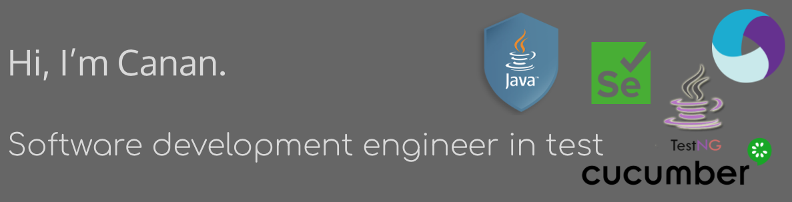

I do content on Java SDET. I really enjoy learning new tools and techniques about Software Testing, as well as working on Selenium, Gurke, TestNG.

Skills: Java / Selenium / TestNG / Cucumber / Appium

